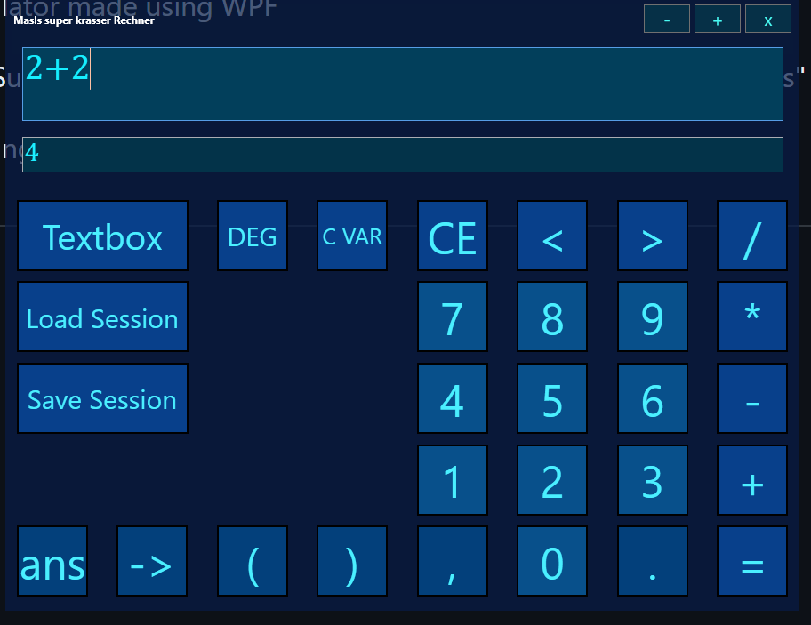

# Calculator-go-brrrrrt
Calculator made using WPF

WIP
Supports +, -, *, /, ** or ^, %, (), variables, functions() and "arrays" (1,2,3)

working on session saving/loading and ig docs

## Screenshots

